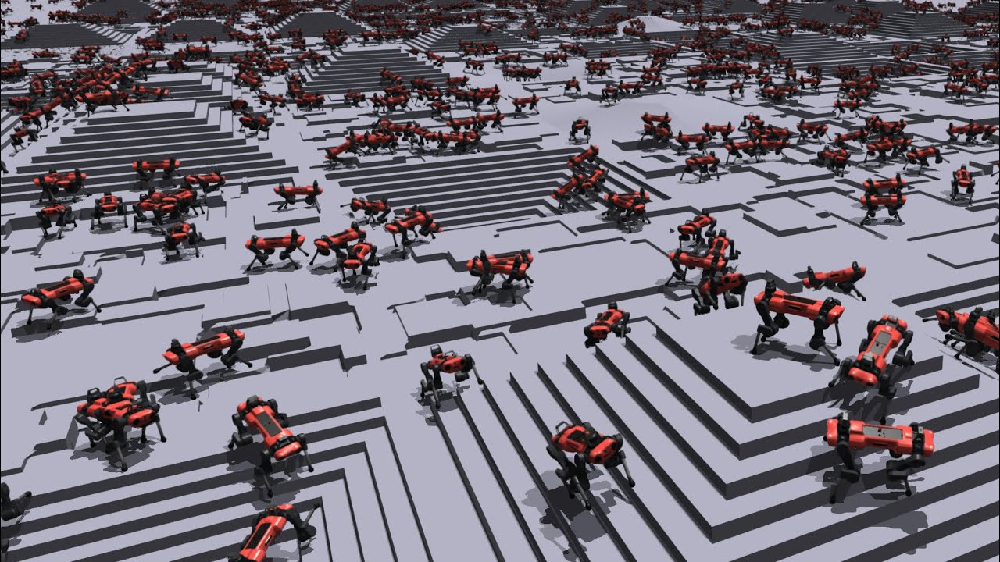
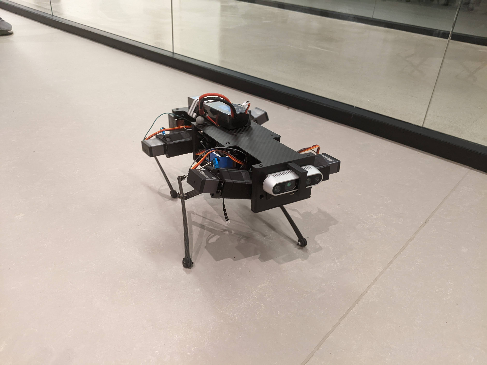

# learning-legged-locomotion
Learning Legged Locomotion project for the course Robot Learning - IFT6163
by Simon Chamorro, Lucas Maes and Valliappan CA

Learning an end-to-end locomotion policy for a quadruped robot in the real world is a difficult problem, mainly because of its complexity, the sample inefficiency of learning algorithms, and the ability to deal with uncertainty. 
However, Sim2Real methods try to tackle this problem by learning in a simulated environment, where data is easy to generate and where collisions do not cause any real damages. 
In this report,we aim to make a cheap and flimsy robot, i.e. the Stanford Pupper, learn to walk in the massively parallelizable simulator Isaac Gym using curriculum learning and a hand-crafted reward function and transfer this policy to the real robot. 
We use PPO to learn our locomotion policy in simulation. 
Finally, we transfer our learned policy to a real physical robot and qualitatively analyse its performance. 
Additionally, we also propose an Isaac Gym compatible model of the Stanford Pupper as well as the Unitree Go1. 
Our work also contains an ablation study of reward terms and a study of different environment parameters to understand the learning process better.

  
  &nbsp; &nbsp; &nbsp; &nbsp;
   

This repository is divided into three sections: Isaac-Gym related code, code for the Stanford Pupper in the PyBullet simulator, and code for the real Stanford Pupper. 
See [INSTALLATION.md](INSTALLATION.md) for installation instructions.
There are usage instructions in README filed in each of our three sub-folders.

## Isaac Gym

This sub-folder contains the code to train locomotion policies in Isaac Gym. 
We used the repositories [legged_gym](https://github.com/leggedrobotics/legged_gym) and [rsl_rl](https://github.com/leggedrobotics/rsl_rl) and adapted them to our needs and added our own robot models.

## Stanford Pupper in PyBullet and Real Robot

The sub-folder`stanford-pupper-pybullet` contains the code we used to test the Stanford Pupper in simulation using the PyBullet simulator. On the other hand, the sub-folder `stanford-pupper` contains the code that was used on the actual physical robot. Both are modified versions of the original StanfordQuadruped repository by Stanford Robotics: [linked here](https://github.com/stanfordroboticsclub/StanfordQuadruped).
