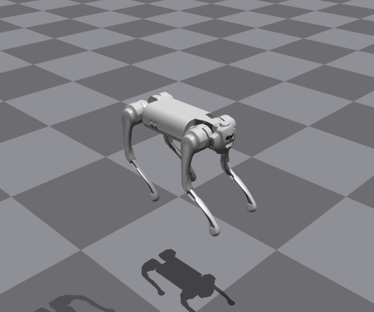
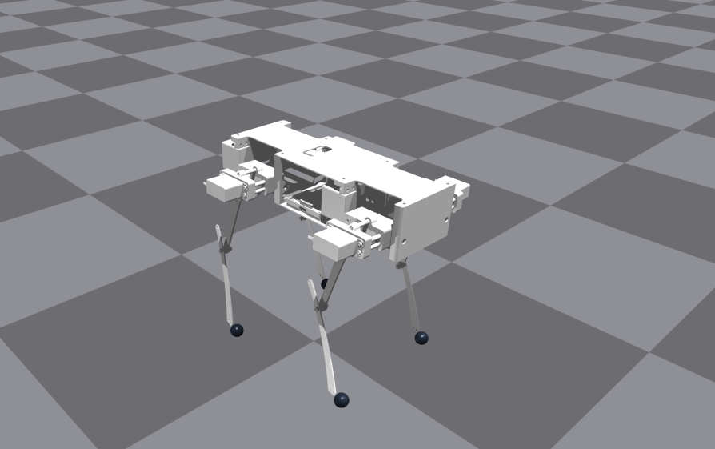

# Isaac Gym 

In this folder, we have all the code to train locomotion policies in Isaac Gym. 
Refer to [rsl_rl](https://github.com/leggedrobotics/rsl_rl) and [legged_gym](https://github.com/leggedrobotics/legged_gym) for the original repositories. 
We adapted the code to our needs, added wandb logging, and experimented with image observations. 
See our [wand report](https://wandb.ai/simonchamorro/legged-gym/reports/Legged-Locomotion-Environment-Experiments-in-Isaac-Gym--VmlldzoxODE2MDY0?accessToken=1110hptvwz8q5zo6gfn4cu6w0348hbped21qtljo0huikqchumsp85czyrxlaey6) for a study of this locomotion task.
We also added our robot models and trained locomotion policies for them.

## Our Robot Models

We created models for the Unitree Go1 and the Stanford Pupper, these are available in `legged_gym/resources/robots`. Additionally, their configuration files are available in `legged_gym/legged_gym/envs`.

  
  &nbsp; &nbsp; &nbsp; &nbsp;
   

## Usage

To train a policy:

`python legged_gym/legged_gym/scripts/train.py --task=go1_flat`

To play an existing policy, we included a pretrained policy as an example:

`python legged_gym/legged_gym/scripts/play.py --task=go1_flat --load_run=best`

Finally, to reproduce our experiments, our bash scripts are in the `experiments` folder. For example, run one like this:

`bash experiments/env_exps.sh`

## Plots

The scripts used to create our plots are in the folder `scripts` and the resulting plots are in the folder `plots`.
