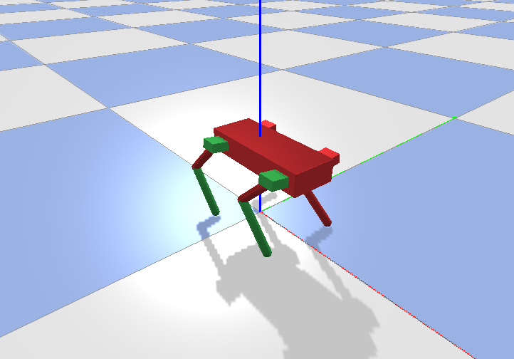
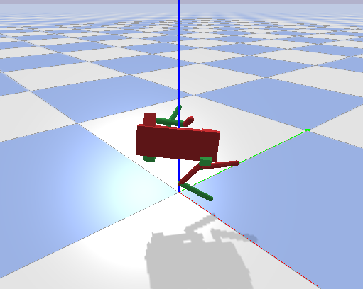

# Stanford Quadruped Pybullet

In this folder, we have our code to run the Stanford Pupper in the PyBullet simulator. 
Refer to [this repo](https://github.com/stanfordroboticsclub/StanfordQuadruped) for the original Stanford Quadruped code.
We modified the simulation code to be able to run both the hard-coded locomotion gait policy from the original repository as well as a learned policy from Isaac Gym.
However, transfer was not successful when using a learned policy, as the applied torques were high and this seemed to cause unrealistic behavior in pybullet such as the robot flying. 
We analyse the observation space and compare it to observations from Isaac Gym. 
See the report for more details.

  
  &nbsp; &nbsp; &nbsp; &nbsp;
   

## Our Scripts

First, we added an Encoders class and an IMU class, in `sim` to simulate the same observations that the robot would have in the real world. 
Then, we refactored the simulation from the original repo to allow more flexibiliy and be able to run either the hard-coded gait or our learned policy.
The `sim` folder contains all the code for the simulation and the `policy` contains helper functions to load the policy as well as a trained policy.
We can save robot data by running the script `save_obs_data.py`. This runs the hard-coded gait for 10 simulated seconds and saves the observations data to a file, which we can later plot using `scripts/plot_state_data.py`.
Finally, `run_sim.py` allows us to run the simuation with either the hard-coded gait or the learned policy. As noted earlier, however, the learned policy does not results in successful locomotion.

