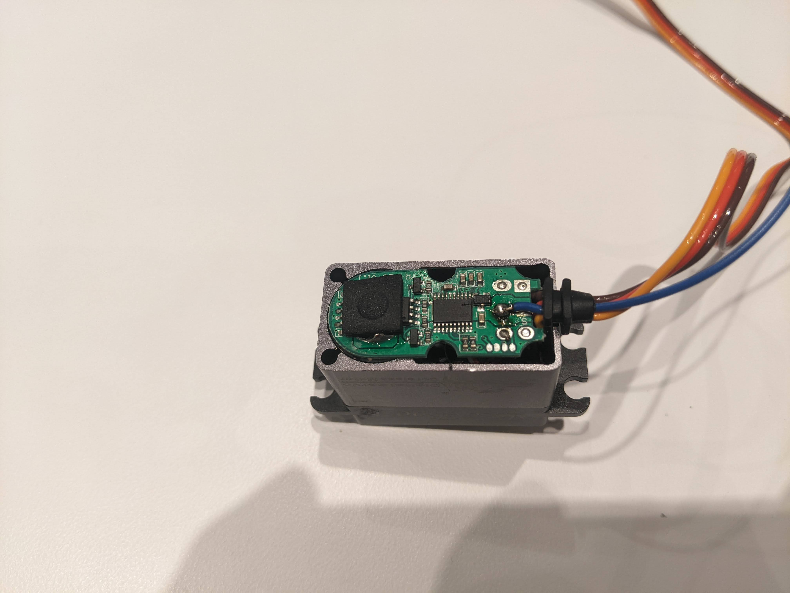
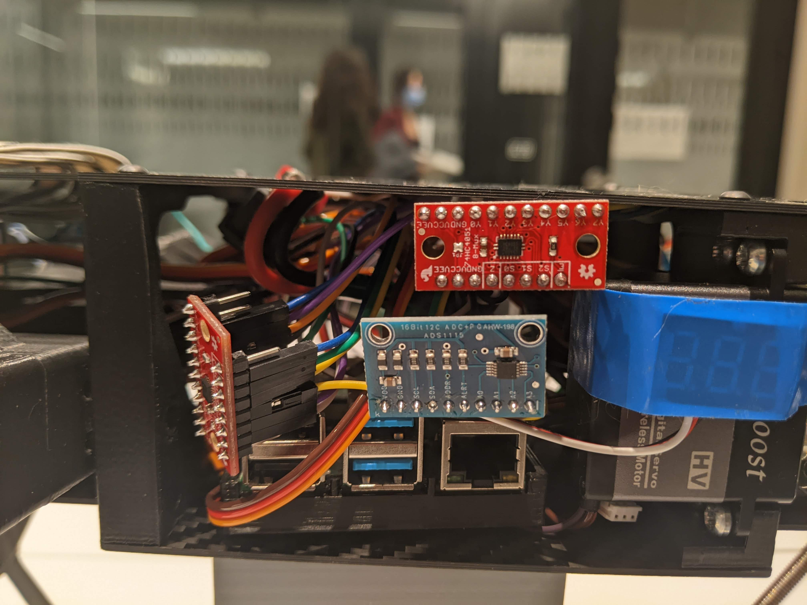
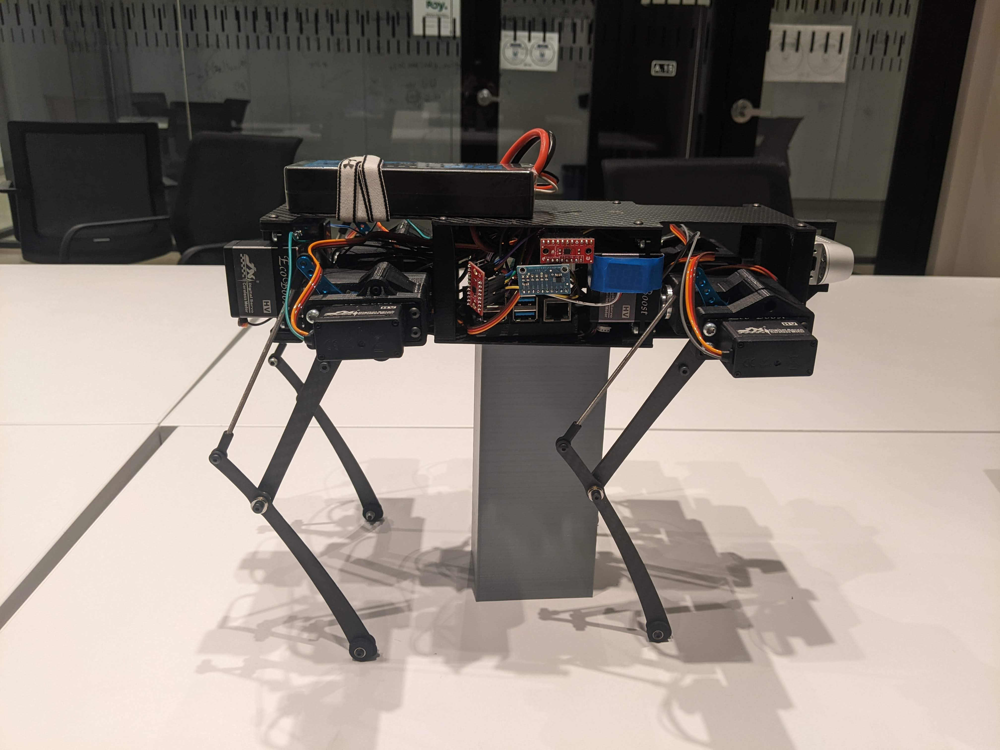
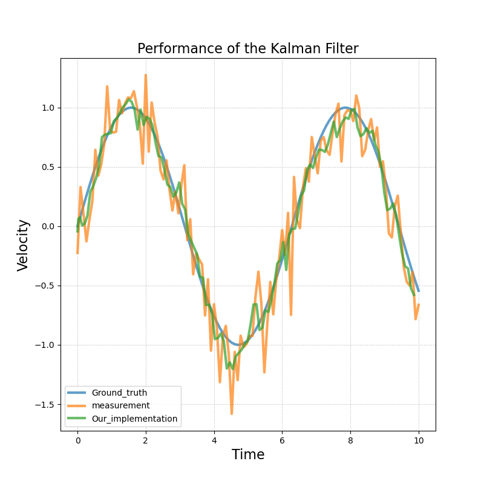
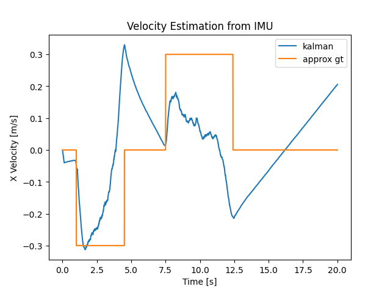
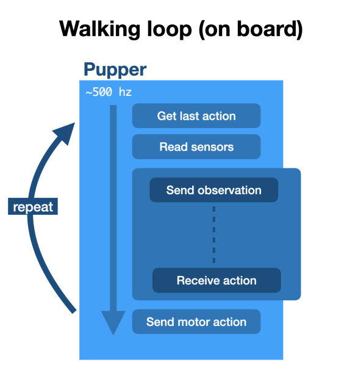
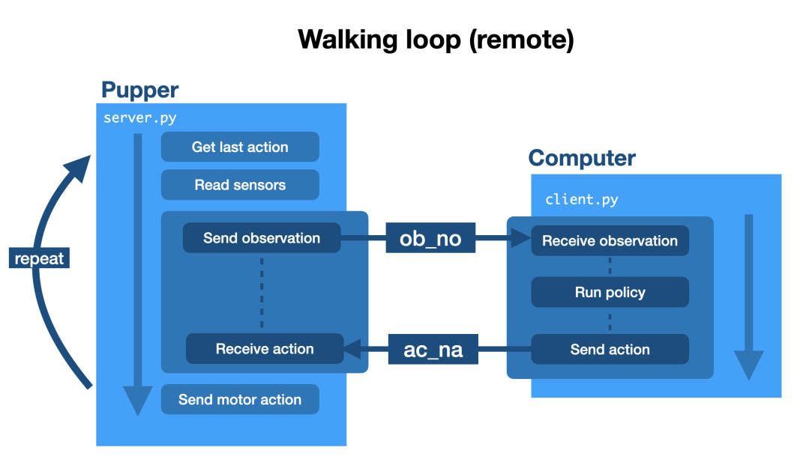

# Stanford Quadruped

In this folder, we have the code that runs on board on the Stanford Pupper. 
Refer to [this repo](https://github.com/stanfordroboticsclub/StanfordQuadruped) for the original Stanford Quadruped code.
First of all, we made some hardware modifications and additions to the Pupper in order to acces the data that we needed for the observations. 
Then, we developped scripts to get the data and run learned policies on the robot.

  

## Hardware Additions

First of all, the robot did not have proprioceptive sensors to read the joint positions in realtime.
We soldered wires to the internal motor encoders to read this values.
The encoders are wired to a multiplexer and an analog to digital converter, which sends the values to the Raspberry Pi via I2C.
The script `scripts/calibrate_encoders.py` is used to calibrate the neutral position values and the script `scripts/read-encoders.py` shows how to read the values in isolation.

  
  &nbsp; &nbsp; &nbsp; &nbsp;
   
  &nbsp; &nbsp; &nbsp; &nbsp;
   

Then, we also added an IMU to estimate the robot velocity. 
Different models of IMU were tested and the different scripts to read their data are in `scripts/read-imu-<model>.py`. They all comunicate through I2C.
We also implemented a kalman filter to smoothen the velocity estimation. 
However, with the integration drift from the IMU acceleration data, we found that the estimate if unusable for observation information. 
While our kalman filter implementation works in isolation, the velocity estimate drifts too much when testing on the real robot. 
A potential solution would be to use a optical tracking system.

  
  &nbsp; &nbsp; &nbsp; &nbsp;
   

## Running a Policy on the Robot

Even though we were not able to run our policy on the real robot due to the inaccuracy of the velocity estimation, we still developped the infrastructure to run the policy.
The script `scripts/get_observations.py` shows how to read the observations using the sensors we added.
Furthermore, we explored the possibilities of running the policy on-board versus running it on an external computer and streaming the observations and the actions.
We used [these binaries](https://github.com/Kashu7100/pytorch-armv7l) to install pytorch on the Raspberry Pi and found that running the policy on-board is much more efficient.

  
  &nbsp; &nbsp; &nbsp; &nbsp;
   

| Method        | Policy Inference Time | Network Delay | Total Loop Time   | 
| ------------- | -------------         | ------------- | -------------     |
| Remote        | 1.14 ms               | 10.59 ms      | 11.73 ms (~85 Hz) |
| On-board      | 1.83 ms               | 0 ms          | 1.83 ms (~545 Hz) |

